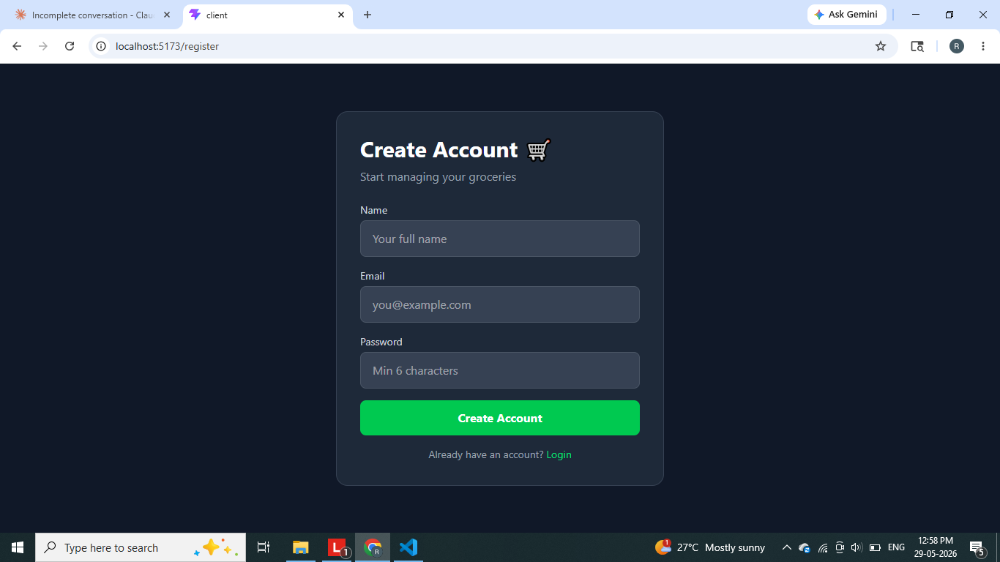
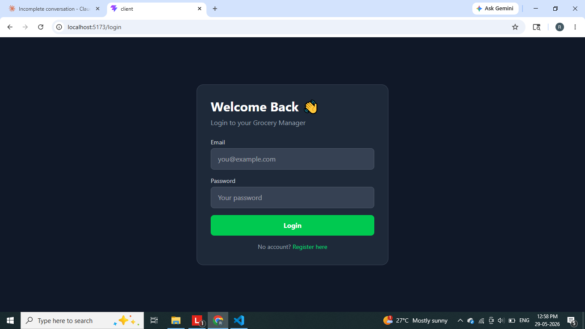
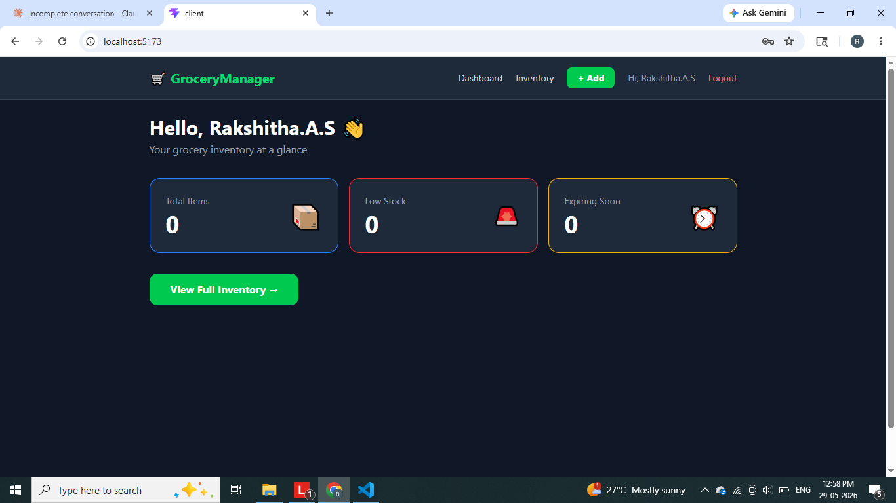
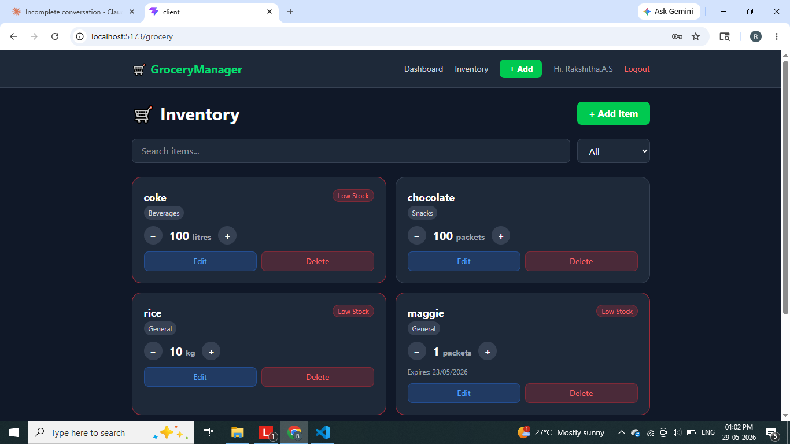
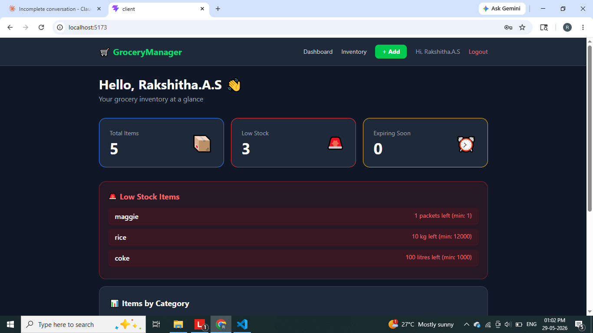
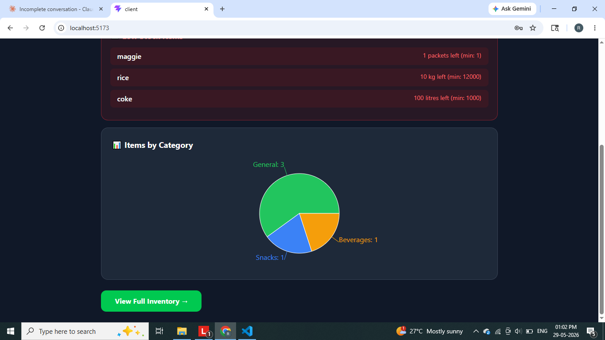

# 🛒 Smart Grocery List & Inventory Manager

A full-stack **MERN** web application to manage grocery inventory with real-time low-stock alerts, expiry tracking, and a live dashboard.


---

## 📌 Problem Statement

Families, students, and small businesses often forget what groceries they have, what's running low, and what's about to expire — leading to waste and unnecessary purchases. This app solves all three problems in one place.

---

## ✨ Features

- 🔐 JWT Authentication — Secure register and login
- ➕ Add / Edit / Delete grocery items
- 📦 Track quantity with + and - controls
- 🚨 Low-Stock Alerts — triggers when quantity falls to or below minimum
- ⏰ Expiry Alerts — warns 7 days before item expires
- 🗂️ Category Filter and Search — find items instantly
- 📊 Dashboard — live summary cards and pie chart
- 📱 Fully responsive — works on mobile and desktop

---

## 🛠️ Tech Stack

| Layer      | Technology                        |
|------------|-----------------------------------|
| Frontend   | React.js (Vite), Tailwind CSS, Recharts |
| Backend    | Node.js, Express.js               |
| Database   | MongoDB Atlas + Mongoose          |
| Auth       | JWT + bcryptjs                    |
| HTTP       | Axios                             |
| Routing    | React Router v6                   |

---

## 📁 Folder Structure
Smart-Grocery-Inventory-Manager/
├── server/
│   ├── config/         → MongoDB connection
│   ├── controllers/    → Business logic
│   ├── middleware/     → JWT verification
│   ├── models/         → Mongoose schemas
│   ├── routes/         → API endpoints
│   └── server.js       → Express entry point
├── client/
│   ├── src/
│   │   ├── components/ → Navbar
│   │   ├── context/    → Auth state
│   │   ├── pages/      → All pages
│   │   └── services/   → Axios API calls
│   └── index.html
├── docs/screenshots/   → Project screenshots
└── README.md

---

## 🔌 API Endpoints

| Method | Endpoint                  | Description          | Auth |
|--------|---------------------------|----------------------|------|
| POST   | /api/auth/register        | Register new user    | ❌   |
| POST   | /api/auth/login           | Login and get token  | ❌   |
| GET    | /api/grocery              | Get all items        | ✅   |
| POST   | /api/grocery              | Add new item         | ✅   |
| PUT    | /api/grocery/:id          | Update item          | ✅   |
| DELETE | /api/grocery/:id          | Delete item          | ✅   |
| PATCH  | /api/grocery/:id/qty      | Update quantity      | ✅   |
| GET    | /api/dashboard/summary    | Dashboard stats      | ✅   |

---

## 🚀 How to Run Locally

### 1. Clone the repository
```bash
git clone https://github.com/YOUR_USERNAME/Smart-Grocery-Inventory-Manager.git
cd Smart-Grocery-Inventory-Manager
```

### 2. Setup Backend
```bash
cd server
npm install
cp .env.example .env
# Fill in your MONGO_URI and JWT_SECRET in .env
npm run dev
```

### 3. Setup Frontend
```bash
cd ../client
npm install
npm run dev
```

### 4. Open in browser
http://localhost:5173

---

## 🔑 Environment Variables

Create `server/.env` with:
PORT=5000
MONGO_URI=mongodb+srv://<username>:<password>@cluster0.xxxxx.mongodb.net/grocerydb
JWT_SECRET=your_secret_key_here

Create `client/.env` with:
VITE_API_URL=http://localhost:5000/api

---

## 📸 Screenshots

| Register | Login | Dashboard |
|----------|-----------|--------------|
|  |  | 


|

---
🎥 Project Demo Video
📌 Watch Full Project Demo

Google Drive Video Link:
https://drive.google.com/file/d/1Bfx4D-VYtVe_ncrr7IjTvyUWS4HTRZcC/view?usp=drive_link

---

## 🎓 What I Learned

- Building REST APIs with Node.js and Express
- JWT authentication and password hashing with bcrypt
- MongoDB schema design and Mongoose ODM
- React hooks, Context API, and React Router
- Axios interceptors for attaching auth tokens
- Tailwind CSS for responsive UI
- Full project structure and GitHub documentation

---

## 👨‍💻 Author

**Rakshitha A S**
B.E. Cybersecurity 


---

## 📄 License

This project is open source and available under the [MIT License](LICENSE).
